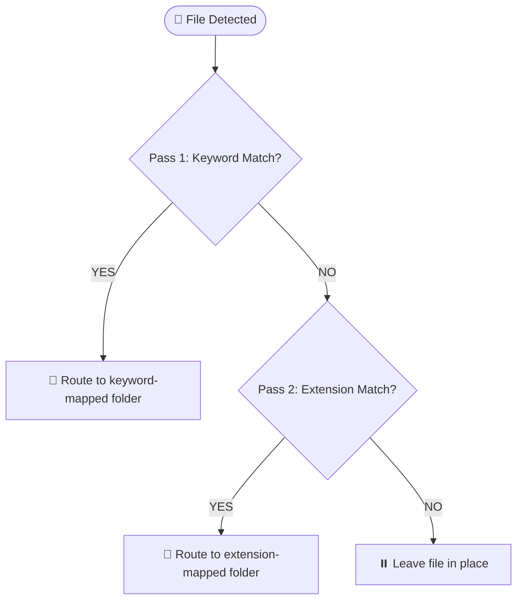

<div align="center">

# 🛡️ Sentinel
### Advanced Real-Time File Automation

*Drop a file. Sentinel handles the rest.*

[](https://python.org)
[](https://pypi.org/project/watchdog/)
[](https://github.com/TomSchimansky/CustomTkinter)
[](https://github.com/aditya-gitzy/Sentinel/releases)
[](LICENSE)
[](https://github.com/aditya-gitzy/Sentinel/releases/latest)

</div>

---

Digital clutter is a nightmare. Standard OS tools either overwrite active downloads, corrupt in-progress transfers, or demand rigid folder structures you have to maintain manually.

**Sentinel** is a resilient background daemon that monitors your directories in real time and routes incoming files to the right place automatically — using a smart two-pass JSON rules engine. It runs completely invisibly. You never manually sort a folder again.

---

## ✨ Features

* **Zero-latency monitoring** — Event-driven via `watchdog`. Files are detected the millisecond they're created. No polling, no wasted CPU.

* **Settle-time buffer** — Sentinel watches byte-stream stability before moving anything. Active downloads are never touched mid-transfer.

* **Two-pass routing engine** — Keyword rules take priority (e.g. files containing `"assignment"` go straight to a specific folder), then extension-based sorting kicks in as a fallback.

* **Atomic collision avoidance** — If a file with the same name already exists at the destination, Sentinel auto-generates a unique path (appending a sequence number) instead of overwriting. Zero data loss, guaranteed.

* **Decoupled headless UI** — A dark-mode CustomTkinter dashboard lets you manage all your sorting rules without ever touching the daemon process.

---

## 🚀 Getting Started

### Option A — Windows Installer *(recommended)*

Download the latest `Sentinel-v1.2.1-windows-x64.exe` from the [Releases page](https://github.com/aditya-gitzy/Sentinel/releases/latest) and run it. The installer handles everything — no Python required on the target machine.

### Option B — Run from Source

**1. Clone**
```bash
git clone https://github.com/aditya-gitzy/Sentinel.git
cd Sentinel
```

**2. Install dependencies**
```bash
pip install -r requirements.txt
```

**3. Configure your rules**

Launch the visual dashboard to define your target directories, file extensions, and keywords:
```bash
python ui.py
```

**4. Start the daemon**
```bash
python main.py
```

> **Windows tip:** Run `start_invisible.vbs` to launch Sentinel silently in the background with no terminal window.

---

## 📂 Project Structure

```
Sentinel/
├── main.py                 # Daemon entry point
├── ui.py                   # CustomTkinter configuration dashboard
├── config.json             # Rule registry (auto-generated on first run)
├── requirements.txt        # Dependencies
├── start_invisible.vbs     # Silent background launcher (Windows)
├── Sentinel.ico            # App icon
├── SentinelSetup.iss       # Inno Setup installer script
├── logs/                   # Runtime operation logs
└── sorter/                 # Core logic
    ├── __init__.py
    ├── watcher.py          # Watchdog observer implementation
    ├── rules.py            # Two-pass routing engine
    └── mover.py            # Atomic file I/O and collision handling
```

---

## ⚙️ How the Rules Engine Works

Sentinel processes every new file through two passes in order:



Rules are stored in `config.json` and managed entirely through the UI — no manual JSON editing needed.

---

## 🛠️ Tech Stack

| Component | Technology |
|---|---|
| File monitoring | `watchdog` (event-driven observer) |
| GUI | `CustomTkinter` (dark-mode dashboard) |
| Rule persistence | JSON |
| Windows packaging | PyInstaller + Inno Setup 6 |
| Silent launcher | VBScript |

---

## 📋 Requirements

- Python 3.10+
- Windows 10/11 or Linux
- See `requirements.txt` for Python dependencies

---

## 🤝 Contributing

Issues and pull requests are welcome. If you hit a bug, open an [issue](https://github.com/aditya-gitzy/Sentinel/issues) with your OS, Python version, and the relevant section from `logs/`.

---

## 📄 License

MIT © [Aditya Lande (aditya-gitzy)](https://github.com/aditya-gitzy)
